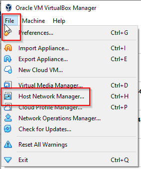
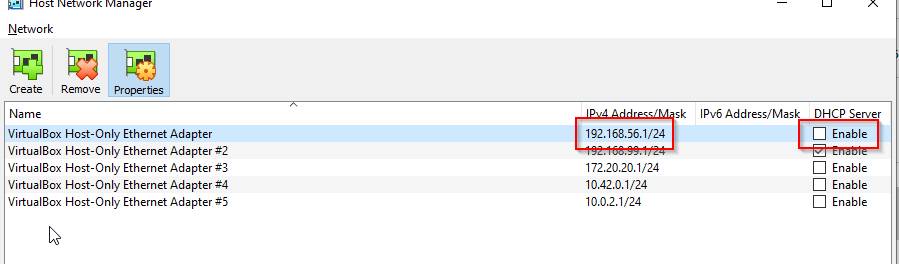
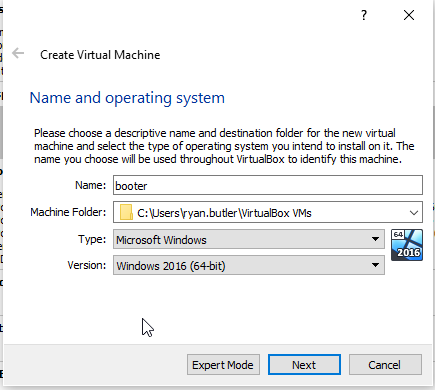
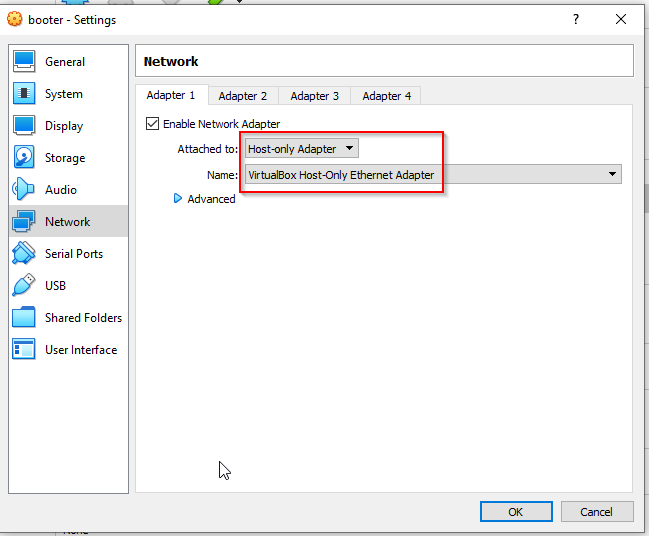
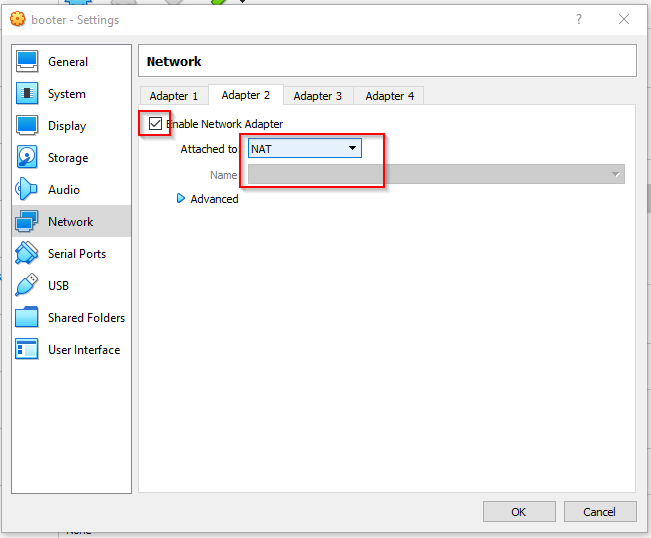

# Purpose
Uses Packer and Vagrant to create a local MDT lab leveraging [Automation Framework Community Edition](https://github.com/haavarstein/Automation-Framework-Community-Edition) running on Virtual Box.

## Creates the following

- 2019 Datacenter image created via Packer
- 2019 Domain controller via Vagrant
- 2019 MDT server via Vagrant
  - DHCP server and scope
  - AFCE installed
  - WDS (Windows Deployment Services) installed, patched and configured

## Big thanks

- [Trond Eirik Haavarstein](https://github.com/haavarstein) for dedicating a massive amount of time for making MDT super easy to get started with.  Check out the paid version of [Automation Framework](https://courses.euctraining.com/) for even more automation goodness.
  - https://github.com/haavarstein/Automation-Framework-Community-Edition/
- [Rui Lopes](https://github.com/rgl/) for so many awesome Packer and Vagrant scripts used for this.
  - https://github.com/rgl/windows-vagrant
  - https://github.com/rgl/windows-domain-controller-vagrant

# Pre-Reqs

The following needs to be installed on the local PC:
- [Virtualbox](https://www.virtualbox.org/wiki/Downloads)
- [Vagrant](https://www.vagrantup.com/downloads)
- [Packer](https://www.packer.io/downloads)

**Note:** All these can be installed with *choco*

```
choco install -y virtualbox packer vagrant packer-provisioner-windows-update
```

Copy the 2019 ISO to root repo dir (eg "C:\afce-vagrant\"):
- [Windows 2019 Eval ISO](https://www.microsoft.com/en-us/cloud-platform/windows-server-trial)

## Vagrant Plugins

- [vagrant-windows-sysprep](https://github.com/rgl/packer-provisioner-windows-update)

```
vagrant plugin install vagrant-windows-sysprep
```

## Packer Plugins

- [packer-provisioner-windows-update](https://github.com/rgl/packer-provisioner-windows-update)

```
choco install packer-provisioner-windows-update
```

# Build Windows 2019 Image
First we need to build the 2019 Datacenter image using Packer. This can take awhile.

```
cd packer
packer build -only=windows-2019-amd64-virtualbox windows-2019.json
#When completed
vagrant box add --name "windows-2019-amd64" -f windows-2019-amd64-virtualbox.box
```

# Virtual Box Setup
While the image builds we can adjust our virtual box network and create our temp machine

## Network

DHCP must be disabled on the *192.168.56.0/24* network





## Test VM
This VM will be used to actually test MDT with

- Create a new VM


- Adjust memory anything you can spare. 2GB should work.
- Create a new virtual disk with VDI (format doesn't really matter)
  - Dynamically allocated
  - Suggest 40gb plus for size
- After machine is created select *Settings* and *Network* on the left
  - Set adapter 1 to host-only
  
  
  - Set adapter 2 to NAT (this will allow internet access)
  
  

# Run Vagrant
This will deploy the environment using the Packer image created earlier

```
#Run as Admin

#If still in Packer dir
cd ..
#From repo root
vagrant up
```

# Connecting

- Once the Vagrant deployment is complete you can access the MDT server with `vagrant rdp mdt` or `vagrant powershell mdt`
- **mylab\vagrant** can be used for authentication
  - Configured as Domain and Enterprise admin
- Local **administrator** password is set to **P@ssw0rd**
